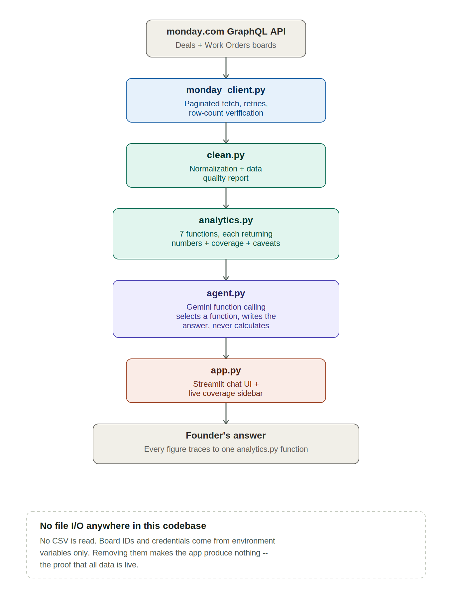

# Skylark Business Intelligence Agent

A conversational agent that answers founder-level business questions by querying two monday.com
boards live — sales pipeline (**Deals**) and project delivery (**Work Orders**).

**Live prototype:** [https://skylark-bi-agent-aoqx2me7kbvpoapptdjtpr.streamlit.app/]
**Source:** [PASTE YOUR GITHUB URL]
**Decision log:** see `DECISION_LOG.md` / `DECISION_LOG.pdf`

> *"How's our pipeline looking for the energy sector this quarter?"*
> *"Which projects are running late?"* · *"Give me a leadership update."*

---

## Contents

1. [Architecture](#architecture)
2. [monday.com setup](#mondaycom-setup)
3. [Running locally](#running-locally)
4. [Deploying](#deploying)
5. [Configuration reference](#configuration-reference)
6. [Design decisions](#design-decisions)
7. [Troubleshooting](#troubleshooting)

---

## Architecture


## Architecture

```
  monday.com GraphQL API
          │  cursor-paginated fetch, retries, count verification
          ▼
  monday_client.py ──── raw items + column metadata
          │
          ▼
  clean.py ──────────── normalization + data-quality report
          │              dates, month names, money, mixed units,
          │              category canonicalization, junk-row removal
          ▼
  analytics.py ──────── 7 analysis functions, each returning
          │              {numbers, coverage, caveats}
          ▼
  agent.py ──────────── Gemini with function calling.
          │              Selects a function, receives its dict,
          │              writes the answer. Never calculates.
          ▼
  app.py ────────────── Streamlit chat UI + live coverage sidebar
```


**The model never touches raw data and never does arithmetic.** It chooses which analysis
function to run and explains the result. Every figure in every answer traces back to a function
in `analytics.py`, which makes fabricated numbers structurally impossible.

### Files

| File | Role |
|---|---|
| `monday_client.py` | GraphQL client. Pagination, retries, per-board error isolation. |
| `clean.py` | API response → tidy DataFrame. All normalization and quality reporting. |
| `analytics.py` | Business logic. Seven functions, each with coverage and caveats. |
| `agent.py` | Gemini tool-calling loop, model fallback, rate-limit handling. |
| `app.py` | Streamlit interface and design system. |
| `quota_check.py` | Diagnostic: which model works, which quota is exhausted. |
| `architecture_diagram.png` / `diagram.svg` | The diagram above, as image and vector source. |

### The seven analysis functions

| Function | Answers |
|---|---|
| `pipeline_summary` | Open deals by stage and probability, with value coverage |
| `win_rate` | Won vs Dead, with mean/median deal size and outlier detection |
| `deals_by_sector` | Per-sector counts, values, win rates, concentration warnings |
| `revenue_summary` | Order book, billing, collections, receivables (GST-consistent) |
| `operational_health` | Execution status, overdue work orders, recurring contracts |
| `sector_performance` | Cross-board: sales performance next to delivery, per sector |
| `leadership_brief` | Everything above, bundled, plus known blind spots |

Each function returns a dict of `{ numbers, coverage, caveats }` — never a formatted string —
so the LLM writes the prose but cannot alter the underlying figures.

---

## monday.com setup

### 1. Create two boards

Import each provided spreadsheet as its own board via **Add → Import data → Excel/CSV**.

| Board | Rows |
|---|---|
| `Work Orders` | 176 |
| `Deals` | 344 |

Column types can mostly be left to monday's own detection. Two worth correcting:

- **`Serial #` → Text**, not Dropdown — it holds 176 unique values.
- **Month-name columns → Text**, not Date (`Last executed month`, `Actual Billing Month`) —
  they contain bare month names with no year.

Import the data **as-is**. Do not clean it in the spreadsheet — handling the mess at runtime is
the point of the assignment, and `clean.py` covers every defect present in the sample data.

### 2. Get an API token

Avatar (top right) → **Administration → Connections → Personal API token** → Copy.
Non-admins: avatar → **Developers → My Access Tokens**.

### 3. Get the board IDs

Open each board. The long number in the browser URL is its ID:
`https://your-team.monday.com/boards/`**`5030963827`**

### 4. Get a Gemini API key

[aistudio.google.com/apikey](https://aistudio.google.com/apikey) → **Create API key**.
Free tier, no card required.

> If you hit a daily quota, create the key in a **new project** — quota is allocated per
> project, so a new project gets a fresh allowance immediately.

---

## Running locally

**Requirements:** Python 3.10+

```bash
git clone <your-repo-url>
cd bi-agent
pip install -r requirements.txt
```

Create a `.env` file in the project root:

```
MONDAY_TOKEN=your_monday_personal_api_token
WORK_ORDERS_BOARD_ID=1234567890
DEALS_BOARD_ID=1234567891
GEMINI_API_KEY=your_gemini_key
GEMINI_MODEL=gemini-3.5-flash-lite
```

**Verify the monday connection before starting the UI:**

```bash
python monday_client.py
```

Expected — the counts must match your boards:

```
Work Orders: 176 items, 38 columns
   counts OK
Deals: 344 items, 12 columns
   counts OK
```

Then launch:

```bash
python -m streamlit run app.py
```

---

## Deploying

Push to a **public** GitHub repository, then deploy on
[share.streamlit.io](https://share.streamlit.io):

1. **New app** → select your repo → branch `main` → main file `app.py`
2. Before deploying, open **Advanced settings → Secrets** and paste, in **TOML** format
   (note the quotes and spaces around `=` — this differs from `.env`):

```toml
MONDAY_TOKEN = "..."
WORK_ORDERS_BOARD_ID = "5030963827"
DEALS_BOARD_ID = "5030963877"
GEMINI_API_KEY = "..."
GEMINI_MODEL = "gemini-3.5-flash-lite"
```

3. **Deploy**, then open the live URL in an incognito window and ask one question to confirm
   it works for someone who isn't logged in as you.

`.env` is gitignored and must never be committed.

---

## Configuration reference

| Variable | Required | Purpose |
|---|---|---|
| `MONDAY_TOKEN` | yes | monday.com personal API token |
| `WORK_ORDERS_BOARD_ID` | yes | Work Orders board ID |
| `DEALS_BOARD_ID` | yes | Deals board ID |
| `GEMINI_API_KEY` | yes | Google AI Studio key |
| `GEMINI_MODEL` | no | Defaults to `gemini-3.6-flash` |
| `STATUS_WON` | no | Labels meaning a won deal. Default `Won` |
| `STATUS_LOST` | no | Labels meaning a lost deal. Default `Dead` |
| `STATUS_OPEN` | no | Default `Open` |
| `STATUS_ON_SCHEDULE` | no | Statuses not counted as late. Default `Completed,Executed until current month` |
| `SMALL_SAMPLE_THRESHOLD` | no | Below this, percentages are flagged unreliable. Default `5` |

The `STATUS_*` variables exist because no algorithm can infer that "Won" means won, or that
"Executed until current month" describes a healthy recurring contract rather than a late one.
Those meanings are declared once, centrally, and are configurable — so a monday account using
different labels (e.g. "Closed Won" instead of "Won") needs a config change, not a code change.

---

## Design decisions

**No hardcoded data.** There is no file I/O anywhere in the codebase — no `read_csv`, no
`read_excel`, no `open()`. Board IDs and credentials come from the environment only. Removing
them makes the app produce nothing, which is the intended proof.

**Data is fetched once per session** and cached in memory, then reused across questions to
respect rate limits. **Refresh from monday.com** in the sidebar clears the cache and re-queries
live.

**Pagination is verified**, not assumed. Each board's fetched row count is checked against its
reported `items_count`. Ignoring monday's cursor would silently return the first 100 rows and
produce confident, wrong totals — the failure mode most likely to go unnoticed.

**Errors degrade rather than crash.** If one board fails to load, the other still works and
questions about it are answered. Retired Gemini models are handled by reading the replacement
name out of the provider's own error response. Rate limits retry using the server's suggested
delay before surfacing anything to the user.

**Coverage is a first-class output, not a footnote.** Every number carries the share of records
behind it, and the sidebar renders those as ticked survey rules that shift colour as coverage
drops. Columns that are entirely empty (e.g. collection dates) are named as untracked rather
than silently reported as zero.

Full reasoning behind every trade-off, and every data-quality defect found in the source boards,
is in `DECISION_LOG.md`.

---

## Troubleshooting

| Symptom | Cause and fix |
|---|---|
| `WORK_ORDERS_BOARD_ID and DEALS_BOARD_ID must both be set` | `.env` not loaded, or saved as `.env.txt` on Windows. On Streamlit Cloud, secrets weren't saved before deploy. |
| `monday.com rejected the token (401)` | Token regenerated or mis-copied. Get a fresh one from Administration → Connections. |
| `404 NOT_FOUND` on the model | Model retired by the provider. The app reads the replacement name from the error and retries automatically; set `GEMINI_MODEL` to skip the failed first attempt. |
| `429` / rate-limit message | Free-tier quota. Per-minute limits clear on their own. For a per-day limit, create a key in a new Google Cloud project. Run `python quota_check.py` to tell which kind you've hit. |
| `503 UNAVAILABLE` | Provider-side overload spike. Retried automatically, then falls back to another model. |
| Row counts don't match the board | Pagination or token permissions issue. Run `python monday_client.py` in isolation to debug. |
| `streamlit: command not found` | Use `python -m streamlit run app.py` instead of the bare `streamlit` command. |
| App works locally but not when deployed | Secrets weren't saved in Streamlit Cloud settings, or `.env` was accidentally committed instead of used as secrets. |
